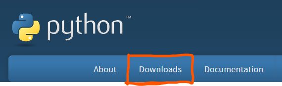
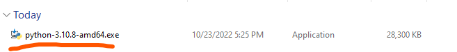
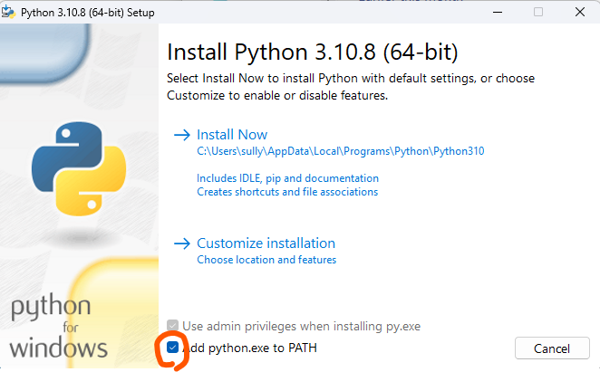
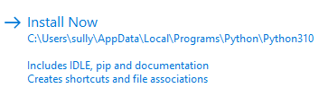

# AFSE-Python-Course
Course for the AFSE coding club.

# Instructions

Each lesson has a unfinished, and a finished version. 

``We recommend that you try to complete the unfinished version first, and if you're having trouble (or if you're checking if you're right) you can go to the completed one.``

# Installing Python

To install python go to [python's website](python.org):
    1. Click ``Downloads``. 

    

    2. Click ``Download Python``. ==Depending on when you're using this guide, the latest version of python might be different; it should work the same.==

    

    3. Open up the installer.

    

    4. Check ``Add python.exe to PATH``.

    

    5. Click ``Install Now``

    

    6. Wait for the install to finish.

    

    7. That's it! You can close the install window, and begin programming.